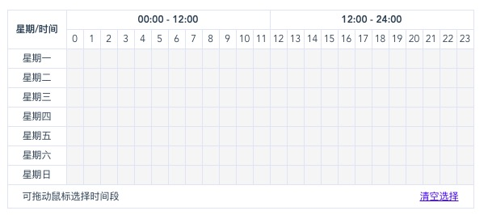
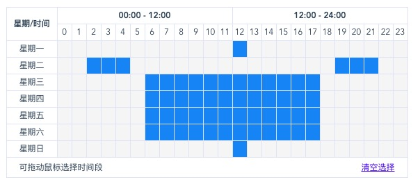

# vue-time-editor

> this is vue components

## Build Setup

``` bash
# install dependencies
npm install

# serve with hot reload at localhost:8080
npm run dev

# build for production with minification
npm run build
```

For detailed explanation on how things work, consult the [docs for vue-loader](http://vuejs.github.io/vue-loader).


# vue-time-editor
仿照新浪微博写的一个时间选择器





##Getting Started
``` javascript
npm install vue-time-editor --save-dev
```

## Quick Start
``` javascript
import TimeEditor from 'vue-time-editor';
Vue.use(TimeEditor);

<TimeEditor v-model="timeEditor" @change="change"></TimeEditor>
export default {
    name: 'app',
    components: {},
    data() {
        return {
            timeEditor: []
        }
    },
    methods: {
        change(value) {
            console.log(value);
        }
    }
}
```

参数 | 类型 | 默认值 | 描述
|:-|:-|:-|:-|
hour | Number | 24 | 时间刻度默认值24小时，可以设置其他值
interval | Number | 60 | 每一个单位格代表多少分钟，默认60，可以设置其他值，值越小控件占据的控件越宽

事件 | 描述
|:-|:-|
change | 返回选中的时间Array，格式[[0],[0],[0],[0],[0],[0],[0]],7个数组对应星期一到星期日，数组中0-23对应小时

